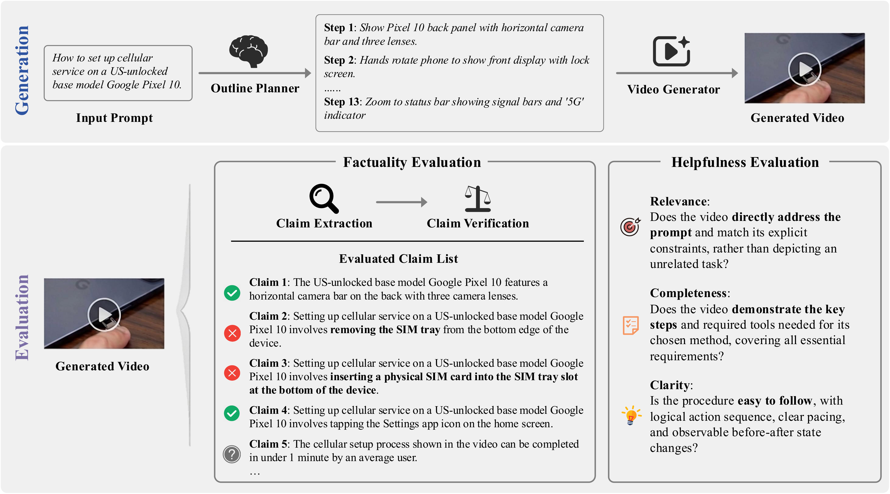

# KIVI: Knowledge-Intensive Video Generation

[](https://arxiv.org/abs/2606.01285)
[](LICENSE)

KIVI evaluates text-to-video models on **factuality** and **helpfulness** — shifting the question from *"Does the video look good?"* to *"Does the video communicate correct and useful information?"*

Given a short instructional prompt (e.g., *"How to set up cellular service on a Google Pixel 10"*), models must generate videos that are factually accurate and practically useful. KIVI-Bench includes 1,080 prompts across 18 knowledge-intensive categories, with automatic metrics that achieve ~70% agreement with human evaluation.

<p align="center">
  
</p>

---

## Installation

```bash
git clone https://github.com/wcxhimself/KIVI
cd KIVI
conda create -n kivi python=3.10 -y && conda activate kivi
pip install -r requirements.txt
conda install ffmpeg
```

**API keys.** Set the following to enable LLM-based script generation and evaluation:

```bash
export LLM_API_KEY={your_key}
export LLM_BASE_URL={your_endpoint}
```

The pipeline uses the OpenAI-compatible API format and defaults to Google Gemini 3.1 Pro via OpenRouter. To switch providers, change `LLM_BASE_URL` and update the model name in the code.

For API-based video generation models, set the provider-specific key:

| Model | Variable |
|---|---|
| Seedance 2.0 | `ARK_API_KEY` |
| HappyHorse 1.0 | `DASHSCOPE_API_KEY` |

---

## Model Repositories

Clone the code for the model(s) you need into `video_generation_models/`, then download their weights to `models_cache/` following each model's official documentation.

You can override the repository's default model-weight locations by setting environment variables or by specifying absolute paths in the model config files.

| Model | Code Repository | Checkpoint (HuggingFace) |
|---|---|---|
| Wan 2.2 | `git clone https://github.com/Wan-Video/Wan2.2 video_generation_models/Wan2.2` | `https://huggingface.co/Wan-AI/Wan2.2-T2V-A14B`, `https://huggingface.co/Wan-AI/Wan2.2-I2V-A14B` |
| HunyuanVideo 1.5 | `git clone https://github.com/Tencent-Hunyuan/HunyuanVideo-1.5 video_generation_models/HunyuanVideo-1.5` | `https://huggingface.co/tencent/HunyuanVideo-1.5` |
| Helios-Base | `git clone https://github.com/PKU-YuanGroup/Helios video_generation_models/Helios` | `https://huggingface.co/BestWishYsh/Helios-Base` |
| LongCat-Video | `git clone https://github.com/meituan-longcat/LongCat-Video video_generation_models/LongCat-Video` | `https://huggingface.co/meituan-longcat/LongCat-Video` |
| LongLive 1.0 | `git clone https://github.com/NVlabs/LongLive/tree/v1.0 video_generation_models/LongLive` | `https://huggingface.co/Efficient-Large-Model/LongLive-1.3B` |
> Seedance 2.0 and HappyHorse 1.0 are API-based and require neither code repositories nor local weights.

---

## Usage

List available models:

```bash
python run_evaluation.py --list-models
```

### Main Arguments

| Argument | Description | Default |
|---|---|---|
| `--model {model}` | Model name to evaluate | *required* |
| `--step {stage}` | Pipeline stage: `all`, `script`, `generate`, `extract`, `verify`, `score` | `all` |
| `--gpu {ids}` | GPU device IDs (e.g. `0` or `0,1` for multi-GPU) | `0` |
| `--category {name}` | Filter by category (e.g. `"Cars_Other_Vehicles"`). Runs all if omitted. | `None` |
| `--prompt-index {n}` | Filter to a specific prompt within a category (1-based). Requires `--category`. | `None` |
| `--prompts-json {path}` | Path to prompts JSON file | `experiment_prompts.json` |

### Full Pipeline

```bash
python run_evaluation.py --model {model}
```

This runs all five stages in order: outline + script → video generation → claim extraction → claim verification → scoring.

### Individual Stages

Each stage reads/writes cached intermediates on disk and can be resumed independently:

```bash
python run_evaluation.py --model {model} --step script              # outline + script
python run_evaluation.py --model {model} --step generate            # video generation
python run_evaluation.py --model {model} --step extract             # claim extraction
python run_evaluation.py --model {model} --step verify              # claim verification
python run_evaluation.py --model {model} --step score               # compute final scores
```

### Custom Video Evaluation

Evaluate your own video without running model generation:

```bash
python run_evaluation.py --video-path {path/to/video.mp4} --prompt {your_video_prompt}
```

Results are saved to `evaluation/` next to the video file.

### Output Structure

```
outputs/{model}/{category}/Q{idx}_{prompt}/
├── final_video.mp4
├── outline.json
├── segment_prompts.json
└── evaluation/
    ├── extracted_claims.json
    ├── verification_results.json
    ├── helpfulness_score.json
    └── score.json
```

### Adding a New Video Generation Model

Four generation modes are supported: `segment` (T2V+I2V), `interactive` (prompt switching), `single_prompt`, and `api` (REST).

Treat the YAML templates in `configs/` as examples only — different models may require model-specific settings; consult the model's upstream documentation and adjust the config accordingly.

```bash
cp configs/_template_segment.yaml configs/{my-model}.yaml
# edit the YAML — fill in name, mode, code_dir, model_path, and generation commands
python run_evaluation.py --model {my-model}
```

---

## Prompt Sets

Two prompt sets are provided in the repository root:

| File | Description |
|---|---|
| `experiment_prompts.json` | 54 prompts (3 per category), used in the paper experiments. **Default.** |
| `kivi_bench_prompts.json` | Full KIVI-Bench: 1,080 prompts across 18 categories. |

Switch with `--prompts-json kivi_bench_prompts.json`.

---

## Evaluation Metrics

### Factual Precision (FactP)

```
FactP = correct claims / total claims × 100%
```

1. **Claim Extraction:** An LLM reviews the generated video and extracts atomic, externally verifiable statements about what the video depicts.
2. **Claim Verification:** Each claim is verified against world knowledge and classified as *Correct*, *Incorrect*, or *Uncertain*.

### Helpfulness Score (HelpS)

```
HelpS = (Relevance + Completeness + Clarity) / 3 × 100%
```

| Dimension | Description |
|---|---|
| Relevance | Does the video directly address the prompt and its explicit constraints? |
| Completeness | Are the key steps and required information covered? |
| Clarity | Is the procedure easy to follow, with logical sequence and clear pacing? |

---

## Results

Results on the 54-prompt subset using Gemini 3.1 Pro Preview as the evaluator:

| Model | FactP (%) | HelpS (%) |
|---|---|---|
| *Human (reference)* | 97.8 | 81.9 |
| Seedance 2.0 | 81.6 | 66.6 |
| HappyHorse 1.0 | 83.2 | 61.6 |
| Wan 2.2 | 73.1 | 48.4 |
| HunyuanVideo 1.5 | 63.2 | 32.9 |
| Helios-Base | 64.2 | 27.0 |
| LongCat-Video | 50.8 | 15.3 |
| LongLive 1.0 | 46.5 | 15.9 |

---

## Repository Structure

```
├── run_evaluation.py            # Main entry point
├── kivi/                        # Core framework
│   ├── utils/                   # Utilities (LLM client, score comparison, model wrappers)
│   ├── generation/              # Video generation (outline, script, models)
│   └── evaluation/              # Claim extraction, verification, helpfulness
├── configs/                     # Per-model YAML configurations
├── prompts/                     # LLM prompt templates
├── video_generation_models/     # Model code (clone manually)
├── outputs/                     # Evaluation outputs
└── models_cache/                # Downloaded model weights
```

---

## Citation

```bibtex
@misc{wang2026knowledgeintensivevideogeneration,
      title={Knowledge-Intensive Video Generation}, 
      author={Chenxu Wang and Mingda Chen},
      year={2026},
      eprint={2606.01285},
      archivePrefix={arXiv},
      primaryClass={cs.CV},
      url={https://arxiv.org/abs/2606.01285}, 
}
```
